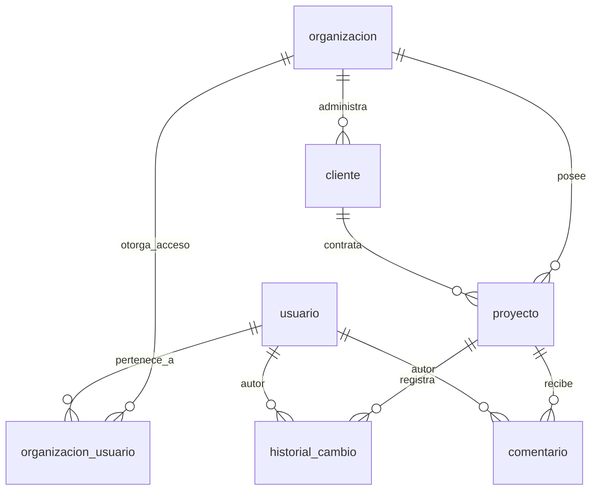
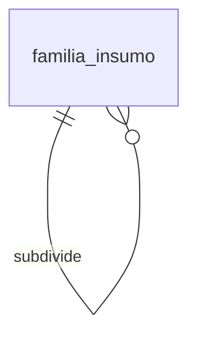
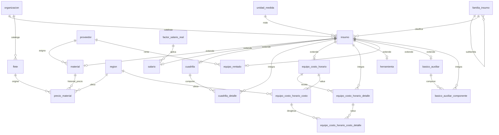
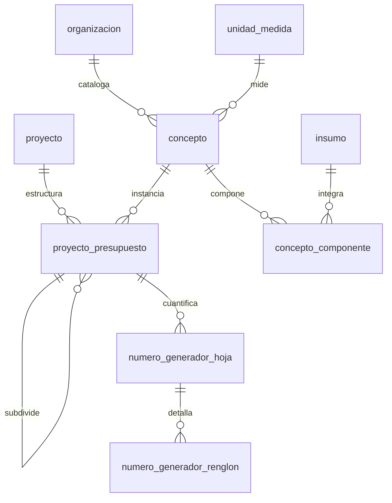
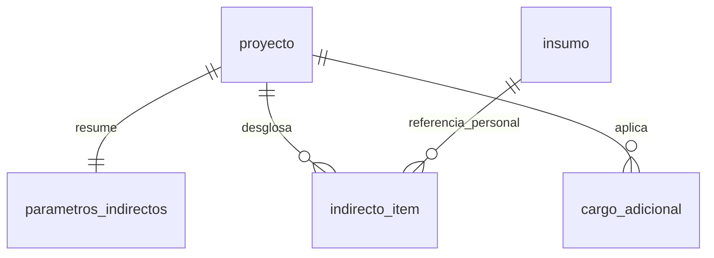
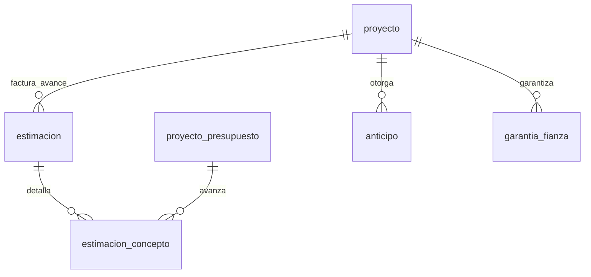
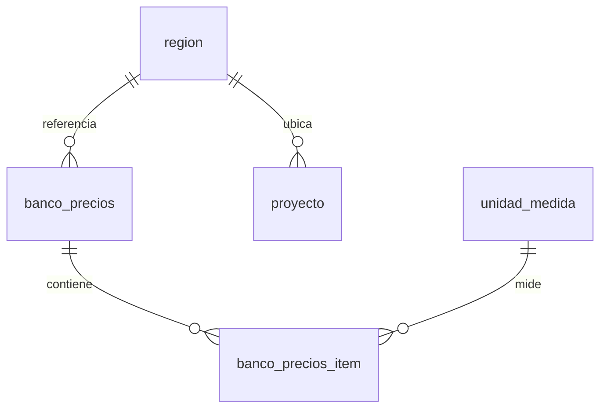

# Modelo de datos — Obrix (Análisis de Precios Unitarios, México)

Modelo de datos diseñado desde cero para un sistema moderno de Análisis de Precios
Unitarios (APU) adaptado al contexto de la construcción en México, tanto obra
**privada** como obra **pública** (Ley de Obras Públicas y Servicios Relacionados
con las Mismas — LOPSRM).

Este documento describe las entidades, relaciones y principios de diseño. El
detalle campo por campo está en [`diccionario-datos.md`](diccionario-datos.md).

## Principios de diseño

- **Identificadores UUID**, no autoincrementales — necesario para colaboración
  multi-usuario y sincronización offline-first sin colisión de IDs.
- **Multi-tenant por organización** — un despacho de costos o constructora puede
  manejar varios clientes y proyectos bajo catálogos de insumos compartidos.
- **Precios historizados donde de verdad aplica** — `precio_material` es una
  tabla de eventos (vigencia desde/hasta), no un campo mutable, porque el
  precio de un material sí se cotiza y varía por proveedor/fecha. `salario`,
  `herramienta` y `equipo_rentado` en cambio guardan su precio como campo
  simple sobrescribible (con `updated_at`/`updated_by`) — una revisión
  salarial o de tarifa reemplaza el dato vigente, no acumula cotizaciones.
- **Auditoría de primera clase** — `historial_cambio` registra cada mutación
  relevante (quién, qué, cuándo, diff). No es opcional ni agregado después.
- **Catálogos alineados a estándares mexicanos** — unidades de medida con su
  clave SAT (para eventual conciliación con CFDI de proveedores), árbol de
  presupuesto (`proyecto_presupuesto`) de profundidad libre que puede modelar
  capítulo/subcapítulo/partida normado o cualquier organización propia del
  despacho, y entidades específicas de obra pública (estimaciones, anticipos,
  fianzas) que no existen en software genérico de estimating anglosajón.
- **Adjuntos y comentarios polimórficos** — cualquier entidad (concepto, insumo,
  estimación) puede llevar archivos adjuntos y comentarios de colaboración, sin
  duplicar esas tablas por cada entidad.

## Módulos

1. [Organización y colaboración](#1-organización-y-colaboración)
2. [Catálogos generales](#2-catálogos-generales)
3. [Catálogo de insumos y precios](#3-catálogo-de-insumos-y-precios)
4. [Estructura del presupuesto y APU](#4-estructura-del-presupuesto-y-apu)
5. [Parámetros financieros](#5-parámetros-financieros)
6. [Ejecución y pagos (obra pública)](#6-ejecución-y-pagos-obra-pública)
7. [Bancos de precios de referencia](#7-bancos-de-precios-de-referencia)
8. [Adjuntos](#8-adjuntos-polimórfico)

---

### 1. Organización y colaboración

Multi-tenant: una organización agrupa clientes y proyectos. `usuario` es una
**identidad global** — no pertenece a una sola organización ni tiene un rol
por organización, sino que `organizacion_usuario` define qué organizaciones
puede ver cada usuario (útil para colaboradores externos que trabajan con
varios despachos). El historial de cambios y los comentarios dan
trazabilidad de colaboración estilo Notion/Linear sobre cualquier entidad
del proyecto.

### 2. Catálogos generales

Catálogos de referencia sin dueño por organización, compartidos por todo el
esquema: `unidad_medida` (con clave SAT), `moneda` (ISO 4217), `region`
(zonificación para ajuste de precios) y `familia_insumo` (clasificación
jerárquica). No llevan campos de auditoría `created_by`/`updated_by` salvo
`familia_insumo`, que sí es editable por el usuario.

### 3. Catálogo de insumos y precios

`insumo` es un **pivote puro**: identidad y referencia compartida (clave,
descripción, unidad, familia), **sin precio propio**. Cada fila adquiere su
comportamiento real mediante exactamente una tabla de extensión 1:1, elegida
según `insumo.tipo` y, dentro de `mano_obra` y `equipo_herramienta`, según su
naturaleza específica — ver la tabla de despacho en el diccionario de datos.
Esto evita tanto la tabla plana de Neodata/Opus (un solo set de columnas
compartido por materiales, mano de obra y equipo, muchas veces sin sentido
para el tipo) como la fragmentación en tablas totalmente separadas (que
multiplicaría las referencias polimórficas en `concepto_componente`, etc.): un único
FK a `insumo` en cualquier parte del esquema resuelve cualquier tipo de
insumo, y cada extensión solo lleva los campos que de verdad le aplican.

- **`salario`** — el salario que paga la nómina (`salario_base_diario`, campo
  simple sin historial) no es el costo real de la mano de obra: se integra
  con un **Factor de Salario Real (FSR)** reutilizable (`factor_salario_real`)
  que cubre prestaciones, cuotas IMSS patronales, INFONAVIT e impuesto sobre
  nómina. Incluye además `porcentaje_herramienta_menor` — la herramienta menor
  (Art. 207 RLOPSRM) nunca se cataloga como insumo aparte, se deriva como %
  sobre esta misma mano de obra.
- **`cuadrilla`** — un equipo de trabajo compuesto (ej. "cuadrilla de
  albañilería" = oficial + 2 ayudantes, o una cuadrilla de topografía que
  incluye su propio equipo de medición) es en sí mismo un insumo `mano_obra`
  más, usable directo en cualquier matriz. Su composición (`cuadrilla_detalle`)
  es **plana, no recursiva** — nunca contiene otra cuadrilla.
- **`equipo_costo_horario`** — el costo de equipo propio no es su
  depreciación lineal: los cargos fijos (depreciación, inversión, seguros,
  mantenimiento) se calculan sobre el valor de la máquina separando llantas
  y piezas especiales, que se deprecian por desgaste, no por tiempo. La
  receta de cargos variables (diesel, aceites, llantas, el operador) vive
  en `equipo_costo_horario_detalle` — plana, no recursiva, compartida entre
  regiones, con `tipo` para distinguir `consumo` de `operacion` y
  `naturaleza` para el desglose CMIC del consumo o, en operación, para
  distinguir categoría FASAR de cuadrilla. El costo
  por hora se valúa por región en `equipo_costo_horario_costo` /
  `equipo_costo_horario_costo_detalle` (precios de material y salarios de
  esa zona, con caída al nacional si faltan) — metodología estándar
  SCT/CMIC.
- **`herramienta`** — herramienta mayor/con motor con precio propio simple
  (sin cálculo de depreciación); distinta de la herramienta menor.
- **`equipo_rentado`** — equipo de terceros con tarifa de renta en vez de
  cálculo de depreciación.
- **`material`** — precio de lista, historizado por región con resolución
  por prioridad (regional → nacional); el precio ya viene "puesto en obra"
  (incluye flete). `flete` es solo un **catálogo de orígenes** (planta,
  cantera) sin precio propio, referenciado desde `precio_material` como dato
  informativo de trazabilidad. El proveedor tampoco es una dimensión del
  precio: si hace falta comparar el mismo material entre proveedores, se dan
  de alta como insumos `material` separados, cada uno con su propio
  `proveedor_id`.
- **`basico_auxiliar`** — material compuesto, mezcla o sistema (concreto,
  mortero, cimbra, impermeabilización) con su propia matriz de insumos. A
  diferencia de `cuadrilla`, **sí permite composición recursiva**: un
  auxiliar puede usar otro auxiliar como componente.

### 4. Estructura del presupuesto y APU

`concepto` es **catálogo maestro** a nivel organización (igual que `insumo`):
se define una vez (clave, descripción, unidad por defecto) y se reutiliza
entre proyectos. Igual que `basico_auxiliar` tiene su propia matriz de
componentes, `concepto` tiene la suya — `concepto_componente` — con el mismo
patrón (insumo + rendimiento + costo, con sus mismos cuatro `sub_total_*`
más `costo_total`); la diferencia es que `concepto` **no es un insumo**: no
cuelga de una extensión 1:1 de `insumo` y no puede usarse como componente de
otro concepto, cuadrilla o básico/auxiliar. Esta matriz de catálogo es una
plantilla orientativa (`concepto.costo_total`) que se copia a
`proyecto_presupuesto.precio_unitario` al instanciar el concepto en un nodo
del presupuesto de un proyecto. No existe una matriz de insumos a nivel
proyecto — el único desglose por insumo vive en `concepto_componente`, a
nivel catálogo; el proyecto solo puede ajustar el `precio_unitario` ya
copiado, sin editar insumo por insumo.

La instancia y ubicación de un concepto dentro de un proyecto viven en un
solo lugar: `proyecto_presupuesto`, un **árbol de profundidad libre** cuyos
nodos son agrupadores (`tipo = grupo`, ej. capítulo/subcapítulo/frente de
obra, sin `concepto_id`) o instancias de un `concepto` de catálogo
(`tipo = partida`, hoja del árbol, con `concepto_id`, `cantidad`,
`precio_unitario` e `importe` propios). Esto reemplaza tanto el patrón más
rígido de un clasificador normado de 3 niveles fijos como la separación
concepto-instanciado/análisis en dos tablas: un mismo concepto de catálogo
puede aparecer en varios nodos/proyectos con cantidad y precio distintos
(los precios varían por región y por proyecto aunque el concepto sea el
mismo). La cuantificación (números generadores) se organiza en hojas por
nodo `partida` para permitir separar el cálculo por eje, nivel o frente de
obra, como se hace en campo.

### 5. Parámetros financieros

Los indirectos no se capturan como un solo porcentaje a ojo: se construyen
desde un desglose itemizado (`indirecto_item` — sueldo de residente de obra,
renta de campamento, papelería, depreciación de equipo de oficina central,
etc.), prorrateado entre el costo directo del proyecto. `parametros_indirectos`
guarda el resultado (el % efectivo de campo y de central) como caché que
alimenta la cascada de cálculo, además de financiamiento y utilidad que sí
son porcentaje puro. Los cargos adicionales (ej. "5 al millar" de vigilancia
SFP, derechos locales) se modelan como catálogo aparte porque varían por
dependencia y contrato, y algunos son obligatorios por ley solo en obra
pública.

### 6. Ejecución y pagos (obra pública)

Específico del contexto mexicano de obra pública: el mecanismo de pago son
**estimaciones** periódicas de avance, con anticipo amortizable y fianzas
obligatorias (Art. 48 LOPSRM: anticipo, cumplimiento, vicios ocultos).

### 7. Bancos de precios de referencia

Catálogos externos importables (INDAABIN, CMIC, CFE, PEMEX, SCT, estatales),
ajustables por región dado que el costo de insumos varía significativamente
entre zona metropolitana, frontera norte y sureste. Nunca se referencian en
vivo desde un concepto: un insumo copia el precio al importarlo, sin
conservar una referencia de vuelta al banco de precios de origen.

### 8. Adjuntos (polimórfico)

`adjunto` referencia cualquier entidad vía (`entidad`, `entidad_id`) — planos,
fotos de campo que sustentan un renglón de números generadores, evidencia de
una estimación, etc. No se modela un diagrama de relación fija porque es
intencionalmente polimórfico; ver el diccionario de datos para el detalle.

---

Ver [`diccionario-datos.md`](diccionario-datos.md) para el detalle de cada
tabla: campos, tipos, valores permitidos y notas de negocio.
